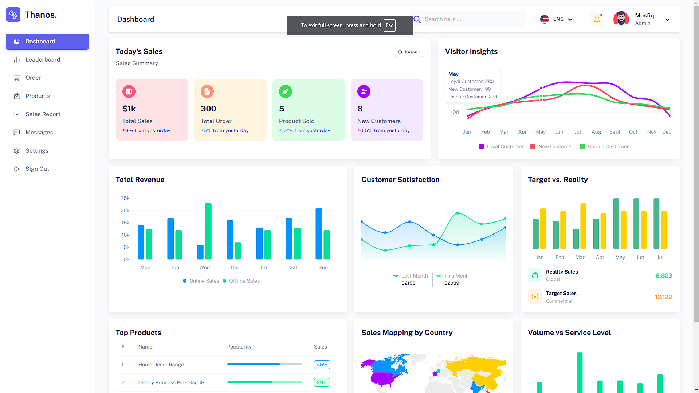

# Finance Dashboard React Pro

A modern finance dashboard built with React.js, showcasing sales insights, customer satisfaction metrics, and more.



## Table of Contents
- [Overview](#overview)
- [Features](#features)
- [Demo](#demo)
- [Installation](#installation)
- [Usage](#usage)
- [Technologies Used](#technologies-used)
- [Contributing](#contributing)
- [License](#license)

---

## Overview
The Finance Dashboard is designed to provide a clean and user-friendly interface for monitoring key financial metrics, tracking sales, and gaining insights into customer behavior.

## Features
- **Sales Insights**: Track total sales, orders, and new customers.
- **Customer Satisfaction**: Visualize customer satisfaction trends.
- **Revenue Analysis**: Compare online and offline sales.
- **Top Products**: See the most popular products.
- **Geographic Insights**: Map sales by country.
- **Responsive Design**: Fully responsive and works across all devices.

## Demo
Check out the live demo: [Finance Dashboard](https://finance-dashboard-react-pro.vercel.app/)

## Installation
1. Clone the repository:
   ```bash
   git clone https://github.com/ARMANANS1218/Finance-Dashboard-react-pro.git
